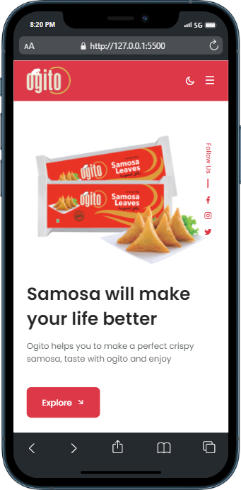
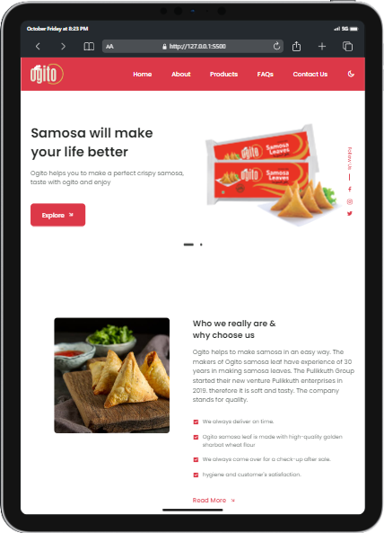
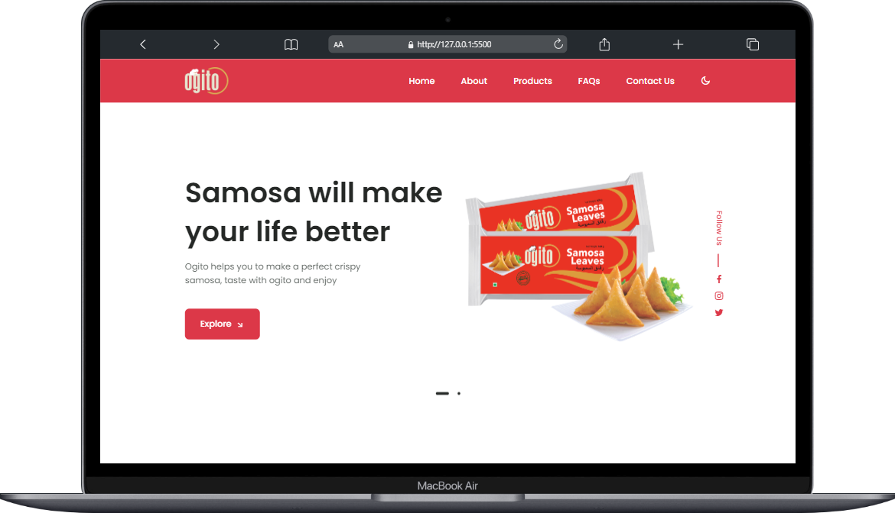

# Responsive Product Websites 

Responsive Product website with More features . Compatible with all mobile devices and with a beautiful and pleasant user interface. 😎


## Preview






## Features

- Responsive Plants Website Using HTML, CSS and JavaScript.
- Contains animations when scrolling.
- Includes a dark and light mode.
- Developed first with the Mobile First methodology, then for desktop.
- Compatible with all mobile devices and with a beautiful and pleasant user interface.


## 🛠 Skills
Javascript HTML, CSS, Remix icons, Git....


## Run Locally

Clone the project

```bash
  git clone https://link-to-project
```

Go to the project directory

```bash
  cd my-project
```

you can acess with changing commits


## Support

For support, email basilxg321@gmail.com


## Authors

- [@iambasilp](https://www.github.com/iambasilp)

